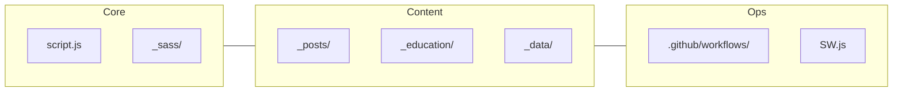

# figarist.github.io (EXTREME EDITION)

<div align="center">
  
</div>

---

## 🗺️ PROJECT MAP



---

## ⚡ QUICK START (DEVELOPER)

Clone the ecosystem and launch the production-mode environment:

```powershell
git clone https://github.com/figarist/figarist.github.io.git
cd figarist.github.io
bundle install
# Launch with full optimization + PWA + Localization
JEKYLL_ENV=production bundle exec jekyll serve
```

---

## 🛠️ TECHNICAL STACK MATURITY

| Feature               | Technology                         | Status        |
| :-------------------- | :--------------------------------- | :------------ |
| **Engine**            | Jekyll 4.3                         | ⚡ Stable     |
| **Localization**      | Quadrilingual (EN, UK, RU, KO)     | 🌍 Native     |
| **UX**                | PWA (Workbox) + View Transitions   | ✨ Premium    |
| **Performance**       | WebP + Minification + Lazy-loading | 🚀 Optimized  |
| **Technical Visuals** | Spaceship (Mermaid/MathJax)        | 📊 Active     |
| **Analytics**         | GoatCounter (Privacy-first)        | 📈 Integrated |

---

## 🏗️ EXTREME DOCUMENTATION DEEP-DIVE

- 🤖 [gemini3rules.md](.agents/rules/gemini3rules.md) — The AI Agent Constitution.
- 📖 [project_context.md](project_context.md) — Architectural patterns and AI Handoffs.
- 🚀 [deployment_guide.md](deployment_guide.md) — PWA Audits and CI/CD troubleshooting.
- 🌐 [quadrilingual-sync.md](.agent/workflows/quadrilingual-sync.md) — The DRI protocol for translations.

---

## 📂 STRUCTURE MINI-GUIDE

- `_includes/` → Modular components (Header, Foot, Author Box).
- `_data/` → Localization dictionaries (Strings).
- `_layouts/` → Bento blueprints (Default, Post, Edu).
- `assets/` → Compressed media & SCSS manifests.

---

## 🤖 AI ASSISTANT PROTOCOL (EXTREME)

1. **Strict Embedded-First:** No frameworks. No bloat.
2. **Bento Rigor:** `grid-template-areas` is the only way.
3. **Quad-Sync:** Every new post needs 4 language siblings.
4. **Performance:** JS < 20KB, CSS < 30KB.

---

<div align="center">
  <strong>💜 Developed with extreme precision by Ihor Sivochka | 2026 💜</strong>
  <br/>
  <sub>𝙿𝚞𝚛𝚎 𝙽𝚊𝚝𝚒𝚟𝚎 𝙿𝚘𝚠𝚎𝚛 | 𝚉𝚎𝚛𝚘-𝚋𝚕𝚘𝚊𝚝 𝙰𝚛𝚌𝚑𝚒𝚝𝚎𝚌𝚝𝚞𝚛𝚎</sub>
</div>
