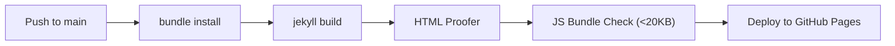

# figarist.github.io (EXTREME EDITION)

<div align="center">
  
</div>

---

## 🗺️ PROJECT MAP

```mermaid
graph LR
    subgraph Core
        JS["script.js (IIFE, <20KB)"]
        SCSS["_sass/ (20 partials)"]
    end
    subgraph Content
        Posts["_posts/ (21 posts × 4 langs)"]
        Edu["_education/ (collections)"]
        Langs["_data/ (EN, UK, RU, KO)"]
    end
    subgraph Plugins
        TOC["jekyll-toc"]
        Archives["jekyll-archives"]
        LMA["jekyll-last-modified-at"]
        Spaceship["jekyll-spaceship"]
        SEO["jekyll-seo-tag"]
    end
    subgraph Ops
        GA[".github/workflows/jekyll.yml"]
        PWA["Service Worker + manifest.json"]
        Proofer["HTML Proofer + Bundle Check"]
    end
    Core --- Content
    Content --- Plugins
    Plugins --- Ops
```



---

## ⚡ QUICK START

```powershell
git clone https://github.com/figarist/figarist.github.io.git
cd figarist.github.io
bundle install

# Production (full optimization + PWA + minification)
JEKYLL_ENV=production bundle exec jekyll serve

# Development (fast builds, no minification, no PWA)
bundle exec jekyll serve --config _config.yml,_config_dev.yml
```

---

## 🛠️ TECH STACK

| Feature               | Technology                                   | Status        |
| :-------------------- | :------------------------------------------- | :------------ |
| **Engine**            | Jekyll 4.4                                   | ⚡ Stable     |
| **Architecture**      | Hub Bento Grid (`grid-template-areas`)       | 🏗️ Core       |
| **Localization**      | Quadrilingual (EN, UK, RU, KO)               | 🌍 Native     |
| **UX**                | PWA (Workbox) + Liquid Glass UI              | ✨ Premium    |
| **Performance**       | Minification + Lazy-loading                  | 🚀 Optimized  |
| **TOC**               | `jekyll-toc` (auto-generated)                | 📋 Active     |
| **Archives**          | `jekyll-archives` (categories/tags)          | 🗂️ Active     |
| **Freshness**         | `jekyll-last-modified-at` (git)              | 🔄 Active     |
| **Technical Visuals** | `jekyll-spaceship` (Mermaid/MathJax)         | 📊 Active     |
| **SEO**               | JSON-LD (BlogPosting + BreadcrumbList)       | 🔍 Full       |
| **Analytics**         | GoatCounter (Privacy-first)                  | 📈 Integrated |
| **CI/CD**             | GitHub Actions + HTML Proofer + Bundle Check | 🛡️ Hardened   |

---

## 📂 ARCHITECTURE

### Directory Structure

```
figarist.github.io/
├── _config.yml                # Main config (plugins, polyglot, TOC, archives)
├── _config_dev.yml            # Dev overlay (no minification, no PWA)
├── manifest.json              # PWA Web App Manifest
├── script.js                  # Single IIFE (9 modules, <20KB budget)
│
├── _layouts/
│   ├── default.html           # Shell: head → header → main → footer → search
│   ├── post.html              # Blog posts: TOC, breadcrumbs, JSON-LD, related
│   ├── education.html         # Tutorials: level badge, tags, JSON-LD
│   └── archive.html           # Auto-generated category/tag pages
│
├── _includes/
│   ├── head.html              # <head>: meta, fonts, SEO, analytics, PWA
│   ├── header.html            # Sticky nav: sections, search trigger, lang-switch
│   ├── footer.html            # 3-col footer: brand, explore, connect
│   ├── breadcrumbs.html       # BreadcrumbList JSON-LD (post/education/archive)
│   ├── lang-redirect.html     # Auto-redirect based on browser/localStorage lang
│   ├── search-modal.html      # Full-text search modal (Cmd+K)
│   └── author_box.html        # Post author card
│
├── _sass/                     # 20 Modular SCSS Partials:
│   ├── _variables.scss        # Design tokens (Cloud Dancer palette)
│   ├── _base.scss             # Reset, a11y, scrollbar, reduced-motion
│   ├── _layout.scss           # Hub page layout, nav, header
│   ├── _grid.scss             # Bento grid (grid-template-areas)
│   ├── _cards.scss            # Base card styles + responsive overrides
│   ├── _card-bio.scss         # Bio card + doodles
│   ├── _card-studio.scss      # Studio card + watch mockups
│   ├── _card-webgl.scss       # WebGL overlay + iframe
│   ├── _card-stack.scss       # Tech stack blueprint grid
│   ├── _card-shrine.scss      # Shrine gradient card
│   ├── _card-python.scss      # Terminal mockup card
│   ├── _card-feed.scss        # All feed cards (blog, vr, gamedev, personal, edu)
│   ├── _hub-pages.scss        # Blog/education/collection/404 hub pages
│   ├── _post.scss             # Article typography, breadcrumbs, related posts
│   ├── _search.scss           # Search modal overlay
│   ├── _components.scss       # Buttons, badges, pagination, banners
│   ├── _spaceship.scss        # Spaceship plugin overrides (Mermaid, MathJax)
│   ├── _footer.scss           # Footer grid + socials
│   ├── _toc.scss              # Table of Contents nav + updated badge
│   └── _archive.scss          # Archive pages (pills, navigation, tags)
│
├── _data/
│   ├── en/strings.yml         # English UI strings (130+ keys)
│   ├── uk/strings.yml         # Ukrainian
│   ├── ru/strings.yml         # Russian
│   └── ko/strings.yml         # Korean
│
├── _posts/                    # 21 blog posts (5 articles × 4 langs + 1 test)
├── _education/                # Tutorial collection
├── blog/index.html            # Blog hub with category/tag pills + pagination
├── education/index.html       # Education hub
├── collection/index.html      # Shrine/collection hub
├── 404.html                   # Custom 404 page
│
└── .github/workflows/
    └── jekyll.yml             # CI: build → HTML Proofer → Bundle Check → deploy
```

### SCSS Import Order (`styles.scss`)

```scss
@use "variables"; // 1. Design tokens
@use "base"; // 2. Reset & a11y
@use "layout"; // 3. Page structure
@use "grid"; // 4. Bento grid
@use "cards"; // 5. Base card styles
@use "card-bio"; // 6-12. Per-card partials
@use "card-studio";
@use "card-webgl";
@use "card-stack";
@use "card-shrine";
@use "card-python";
@use "card-feed";
@use "hub-pages"; // 13. Hub sub-pages (blog, edu, 404)
@use "post"; // 14. Article + breadcrumbs
@use "search"; // 15. Search modal
@use "components"; // 16. Shared UI (buttons, badges)
@use "spaceship"; // 17. Spaceship overrides
@use "footer"; // 18. Footer
@use "toc"; // 19. Table of Contents
@use "archive"; // 20. Archive pages
```

### script.js Modules (IIFE)

| §   | Module           | Purpose                                       |
| --- | ---------------- | --------------------------------------------- |
| 1   | Scroll Fade-In   | `IntersectionObserver` for `.fade-in` cards   |
| 2   | WebGL Overlay    | Click-to-load iframe for Unity demos          |
| 3   | Card Tilt        | 3D perspective on hover (`bento-tilt-target`) |
| 4   | Reading Progress | Scroll-based progress bar                     |
| 5   | Copy Code        | Click-to-copy on code blocks                  |
| 6   | Navbar Scroll    | Show/hide on scroll direction                 |
| 7   | View Transitions | Client-side `startViewTransition()`           |
| 8   | Search           | Full-text search with `search.json`           |
| 9   | Lang Switch      | Save `preferred_lang` to localStorage         |
| —   | SW Registration  | Service Worker (`/sw.js`) registration        |

---

## 🔌 PLUGINS

| Plugin                    | Purpose                      | Config                                      |
| ------------------------- | ---------------------------- | ------------------------------------------- |
| `jekyll-seo-tag`          | Auto SEO meta tags           | `_config.yml` defaults                      |
| `jekyll-sitemap`          | Auto XML sitemap             | —                                           |
| `jekyll-feed`             | RSS/Atom feeds               | —                                           |
| `jekyll-polyglot`         | Quadrilingual routing        | `languages: [en, uk, ru, ko]`               |
| `jekyll-paginate-v2`      | Blog pagination              | `per_page: 6`                               |
| `jekyll-spaceship`        | Mermaid, MathJax, YouTube    | Enabled globally                            |
| `jekyll-minifier`         | HTML/CSS/JS minification     | Production only                             |
| `jekyll-redirect-from`    | URL redirects                | —                                           |
| `jekyll-pwa-workbox`      | Service Worker + offline     | `sw.js`                                     |
| `jekyll-toc`              | Auto Table of Contents       | `toc: true` in front matter                 |
| `jekyll-last-modified-at` | Git-based modification dates | Auto from git log                           |
| `jekyll-archives`         | Category/tag archive pages   | `/blog/category/:name/`, `/blog/tag/:name/` |

---

## 🔍 SEO & STRUCTURED DATA

Every page has:

- **`jekyll-seo-tag`**: Auto title, description, canonical, OG, Twitter cards
- **`hreflang`**: Auto-generated by `jekyll-polyglot` for 4 languages
- **Sitemap**: Auto XML sitemap at `/sitemap.xml`

Post/Education pages additionally have:

- **BlogPosting / Article JSON-LD**: `datePublished`, `dateModified`, author, publisher
- **BreadcrumbList JSON-LD**: Hub → Section → Article
- **`apple-touch-icon`**: For iOS PWA

---

## 🚀 CI/CD PIPELINE



Hardened checks:

- **HTML Proofer**: Link integrity (ignores Google Fonts, Mermaid CDN)
- **Bundle Size**: `script.js` must be < 20KB (20480 bytes)

---

## 🤖 AI ASSISTANT RULES

1. **Embedded-First**: No React, Vue, Tailwind, jQuery. Pure HTML/CSS/JS/Liquid.
2. **Hub Rigor**: `grid-template-areas` only. No `grid-auto-flow: dense`.
3. **Quad-Sync**: Every post needs 4 language siblings sharing exact `permalink`.
4. **Performance Budget**: JS < 20KB, CSS < 30KB (gzipped).
5. **Zero Inline Styles**: All styling in `_sass/` partials. Only `view-transition-name` allowed inline (Liquid-dependent).
6. **ES5 Syntax**: No arrow functions outside the IIFE. `function()` for compatibility.
7. **Semantics**: `<article>`, `<section>`, `<nav>`, `<time>`. `aria-label` on icon-only buttons.

See [gemini3rules.md](.agents/rules/gemini3rules.md) for full rules.

---

<div align="center">
  <strong>💜 Developed with extreme precision by Ihor Sivochka | 2026 💜</strong>
  <br/>
  <sub>𝙿𝚞𝚛𝚎 𝙽𝚊𝚝𝚒𝚟𝚎 𝙿𝚘𝚠𝚎𝚛 | 𝚉𝚎𝚛𝚘-𝚋𝚕𝚘𝚊𝚝 𝙰𝚛𝚌𝚑𝚒𝚝𝚎𝚌𝚝𝚞𝚛𝚎</sub>
</div>
