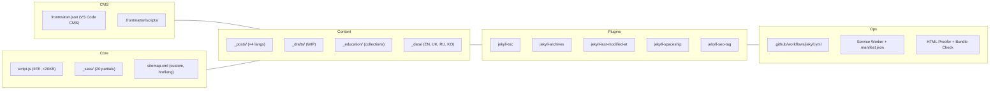
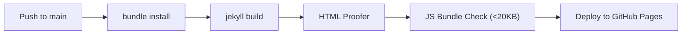

# figarist.github.io (EXTREME EDITION)

<div align="center">
  
</div>

---

## 🗺️ PROJECT MAP


```mermaid
graph LR
    subgraph Core
        JS["script.js (IIFE, <20KB)"]
        SCSS["_sass/ (20 partials)"]
        SM["sitemap.xml (custom, hreflang)"]
    end
    subgraph Content
        Posts["_posts/ (×4 langs)"]
        Drafts["_drafts/ (WIP)"]
        Edu["_education/ (collections)"]
        Langs["_data/ (EN, UK, RU, KO)"]
    end
    subgraph CMS
        FM["frontmatter.json (VS Code CMS)"]
        Scripts[".frontmatter/scripts/"]
    end
    subgraph Plugins
        TOC["jekyll-toc"]
        Archives["jekyll-archives"]
        LMA["jekyll-last-modified-at"]
        Spaceship["jekyll-spaceship"]
        SEO["jekyll-seo-tag"]
    end
    subgraph Ops
        GA[".github/workflows/jekyll.yml"]
        PWA["Service Worker + manifest.json"]
        Proofer["HTML Proofer + Bundle Check"]
    end
    CMS --- Content
    Core --- Content
    Content --- Plugins
    Plugins --- Ops
```

---

## ⚡ QUICK START

```powershell
git clone https://github.com/figarist/figarist.github.io.git
cd figarist.github.io
bundle install

# Production (full optimization + PWA + minification)
JEKYLL_ENV=production bundle exec jekyll serve

# Development (fast builds, no minification, no PWA)
bundle exec jekyll serve --config _config.yml,_config_dev.yml
```

---

## 🛠️ TECH STACK

| Feature               | Technology                                   | Status        |
| :-------------------- | :------------------------------------------- | :------------ |
| **Engine**            | Jekyll 4.4                                   | ⚡ Stable     |
| **CMS**               | Frontmatter CMS (VS Code extension)          | ✏️ Active     |
| **Architecture**      | Hub Bento Grid (`grid-template-areas`)       | 🏗️ Core       |
| **Localization**      | Quadrilingual (EN, UK, RU, KO)               | 🌍 Native     |
| **UX**                | PWA (Workbox) + Liquid Glass UI              | ✨ Premium    |
| **Performance**       | Minification + Lazy-loading                  | 🚀 Optimized  |
| **TOC**               | `jekyll-toc` (auto-generated)                | 📋 Active     |
| **Archives**          | `jekyll-archives` (categories/tags)          | 🗂️ Active     |
| **Freshness**         | `jekyll-last-modified-at` (git)              | 🔄 Active     |
| **Technical Visuals** | `jekyll-spaceship` (Mermaid/MathJax)         | 📊 Active     |
| **SEO**               | JSON-LD (Person + WebSite + BlogPosting + BreadcrumbList) | 🔍 Full |
| **Sitemap**           | Custom `sitemap.xml` with hreflang (4 langs) | 🗺️ Verified   |
| **Accessibility**     | Skip-link, ARIA labels, focus states         | ♿ Compliant  |
| **Analytics**         | GoatCounter (Privacy-first)                  | 📈 Integrated |
| **CI/CD**             | GitHub Actions + HTML Proofer + Bundle Check | 🛡️ Hardened   |

---

## 📂 ARCHITECTURE

### Directory Structure

```
figarist.github.io/
├── _config.yml                # Main config (plugins, polyglot, TOC, archives)
├── _config_dev.yml            # Dev overlay (no minification, no PWA)
├── frontmatter.json           # Frontmatter CMS config (content types, snippets, scripts)
├── manifest.json              # PWA Web App Manifest
├── script.js                  # Single IIFE (10 modules, <20KB budget)
├── sitemap.xml                # Custom multilingual sitemap (hreflang, NOT jekyll-sitemap)
│
├── .frontmatter/
│   └── scripts/
│       ├── create-translations.js  # CMS action: auto-generate uk/ru/ko stubs
│       └── check-images.js         # CMS action: list non-WebP images
│
├── _layouts/
│   ├── default.html           # Shell: head → skip-link → header → main → footer → search
│   ├── post.html              # Blog posts: TOC, hierarchical breadcrumbs, JSON-LD, related
│   ├── education.html         # Tutorials: level badge, hierarchical breadcrumbs, tags, JSON-LD
│   └── archive.html           # Auto-generated category/tag pages with breadcrumb nav
│
├── _includes/
│   ├── head.html              # <head>: meta, fonts, SEO, analytics, PWA
│   ├── header.html            # Sticky nav: sections, search trigger, lang-switch
│   ├── footer.html            # 3-col footer: brand, explore, connect
│   ├── breadcrumbs.html       # BreadcrumbList (Hub → Section → Category → Article)
│   ├── related-bento.html     # Circular related posts logic (Atomic)
│   ├── metadata/              # Structured data modules:
│   │   └── json-ld.html       # Unified BlogPosting/Article/Person/WebSite schema
│   ├── lang-redirect.html     # Auto-redirect based on browser/localStorage lang
│   ├── search-modal.html      # Full-text search modal (Cmd+K)
│   └── author_box.html        # Post author card
│
├── _sass/                     # 20 Modular SCSS Partials:
│   ├── _variables.scss        # Design tokens (Cloud Dancer palette)
│   ├── _base.scss             # Reset, a11y (skip-link), scrollbar, reduced-motion
│   ├── _layout.scss           # Hub page layout, nav, header
│   ├── _grid.scss             # Bento grid (grid-template-areas)
│   ├── _cards.scss            # Base card styles + responsive overrides
│   ├── _card-bio.scss         # Bio card + doodles
│   ├── _card-studio.scss      # Studio card + watch mockups
│   ├── _card-webgl.scss       # WebGL overlay + iframe
│   ├── _card-stack.scss       # Tech stack blueprint grid
│   ├── _card-shrine.scss      # Shrine gradient card
│   ├── _card-python.scss      # Terminal mockup card
│   ├── _card-feed.scss        # All feed cards (blog, vr, gamedev, personal, edu)
│   ├── _hub-pages.scss        # Blog/education/collection/404 hub pages
│   ├── _post.scss             # Article typography, breadcrumbs, related posts
│   ├── _search.scss           # Search modal overlay
│   ├── _components.scss       # Buttons, badges, pagination, banners
│   ├── _spaceship.scss        # Spaceship plugin overrides (Mermaid, MathJax)
│   ├── _footer.scss           # Footer grid + socials
│   ├── _toc.scss              # Table of Contents nav + updated badge
│   └── _archive.scss          # Archive pages (pills, navigation, tags)
│
├── _data/
│   ├── authors.yml            # Author profiles (Frontmatter CMS data file)
│   ├── en/strings.yml         # English UI strings (130+ keys, incl. skip_link)
│   ├── uk/strings.yml         # Ukrainian
│   ├── ru/strings.yml         # Russian
│   └── ko/strings.yml         # Korean
│
├── _posts/                    # Blog posts (×4 langs per article)
├── _drafts/                   # WIP posts (not published, git-tracked)
├── _education/                # Tutorial collection
├── blog/index.html            # Blog hub with category/tag pills + pagination
├── education/index.html       # Education hub
├── collection/index.html      # Shrine/collection hub
├── 404.html                   # Custom 404 page
│
└── .github/workflows/
    └── jekyll.yml             # CI: build → HTML Proofer → Bundle Check → deploy
```

### SCSS Import Order (`styles.scss`)

```scss
@use "variables"; // 1. Design tokens
@use "base";      // 2. Reset & a11y (skip-link)
@use "layout";    // 3. Page structure
@use "grid";      // 4. Bento grid
@use "cards";     // 5. Base card styles
@use "card-bio";  // 6-12. Per-card partials
@use "card-studio";
@use "card-webgl";
@use "card-stack";
@use "card-shrine";
@use "card-python";
@use "card-feed";
@use "hub-pages"; // 13. Hub sub-pages (blog, edu, 404)
@use "post";      // 14. Article + breadcrumbs
@use "search";    // 15. Search modal
@use "components";// 16. Shared UI (buttons, badges)
@use "spaceship"; // 17. Spaceship overrides
@use "footer";    // 18. Footer
@use "toc";       // 19. Table of Contents
@use "archive";   // 20. Archive pages
```

### script.js Modules (IIFE)

| §   | Module           | Purpose                                         |
| --- | ---------------- | ----------------------------------------------- |
| 1   | Scroll Fade-In   | `IntersectionObserver` for `.fade-in` cards     |
| 2   | WebGL Overlay    | Click-to-load iframe for Unity demos            |
| 3   | Card Tilt        | 3D perspective on hover (`hub-card`, Rect Cache)|
| 4   | Reading Progress | Throttled scroll-based progress bar             |
| 5   | Copy Code        | Click-to-copy on code blocks                    |
| 6   | Navbar Scroll    | Show/hide on scroll direction                   |
| 7   | View Transitions | Client-side `startViewTransition()`             |
| 8   | Search           | Full-text search with `search.json`             |
| 9   | Lang Switch      | Save `preferred_lang` to localStorage           |
| 10  | Rect Caching     | Zero-GC layout thrashing prevention (120Hz+)    |
| —   | SW Registration  | Service Worker (`/sw.js`) registration          |

---

## ✏️ FRONTMATTER CMS

The site uses [Front Matter CMS](https://frontmatter.codes/) — a VS Code extension that turns the editor into a full headless CMS without any server or database.

### Content Types

| Type        | Folder        | Key Fields                                           |
| ----------- | ------------- | ---------------------------------------------------- |
| **Post**    | `_posts/`     | title, description, date, lang, **page_id**, permalink, author, **image_alt**, image, categories, tags, published, **focus_keyword, seo_title, seo_type, canonical_url, robots, noindex, sitemap**, *related_posts, featured, hidden, last_modified_at* |
| **Post**    | `_drafts/`    | Same as Post — draft toggle hides from build         |
| **Education** | `_education/` | title, description, excerpt, **page_id**, level, sort_order, author, **image_alt**, image, tags, published, **focus_keyword, seo_title, robots, noindex, sitemap**, *related_posts, featured, hidden, last_modified_at* |

- `author` field is a **data file picker** reading `_data/authors.yml` directly — no manual input
- `image` field links to `assets/images/` with a visual picker
- `published: false` = Jekyll draft (excluded from build via `_config.yml` defaults)

### Content Snippets (18 total)

| Category      | Snippets                                                      |
| ------------- | ------------------------------------------------------------- |
| Spaceship     | YouTube embed, **Vimeo embed, Figma embed**, Local video, Mermaid diagram, MathJax block, Markdown table |
| Polyglot      | Translation note (links to all 4 langs)                       |
| Callouts      | Info, Warning                                                 |
| Code          | Liquid raw block, Rouge highlight with line numbers           |
| Media         | WebP `<figure>` with `figcaption`, `loading="lazy"`, `width/height` |
| Links         | Internal post link (relative_url), Jekyll include tag, **Asset URL** |
| SEO           | Article JSON-LD schema block, **Localized Site String**      |

### Custom CMS Scripts

| Script                       | Trigger      | What it does                                              |
| ---------------------------- | ------------ | --------------------------------------------------------- |
| **`check-seo.js`**           | Content panel button | **Validates** SEO meta limits and focus keyword           |
| **`sync-languages.js`**      | Content panel button | **Primary sync action:** auto-generates stubs + syncs `page_id` + `permalink` |
| `create-translations.js`     | Content panel button | (Legacy) Auto-generates uk/ru/ko stub files from EN source |
| `check-images.js`            | Media folder button  | Scans `assets/images/` and reports all non-WebP files     |
| **`build-manual.js`**        | Content panel button | Provides `bundle exec jekyll build` command for quick copy-paste |

### CMS Workflow: New Post

1. Open **Front Matter** panel in VS Code (`Ctrl+Shift+P → Front Matter: Open Dashboard`)
2. Click **New content** → select **Post** or **Education**
3. Fill required fields (title, lang, permalink, categories, tags)
4. Write content — use **Snippets** panel for Mermaid/YouTube/Vimeo/Figma/callouts
5. Run **🔄 Sync All Languages** action → stubs generated + `page_id` synced instantly
6. Translate stubs, set `published: true` on all 4 files
7. (Optional) Run **🏗️ Build Site (Manual)** to verify before pushing
8. Git commit — message auto-filled as `content: {{title}} [{{date}}]`

---

## 🌐 QUADRILINGUAL SYNC (EN · UK · RU · KO)

> Full workflow: [`/i18n-sync`](.agents/workflows/i18n-sync.md)

**Golden rule: One permalink. Four files. All in sync.** EN is always the source of truth.

### Language Map

| File suffix | `lang:` | URL prefix | Strings file            |
| ----------- | ------- | ---------- | ----------------------- |
| `-en.md`    | `en`    | _(none)_   | `_data/en/strings.yml`  |
| `-uk.md`    | `uk`    | `/uk/`     | `_data/uk/strings.yml`  |
| `-ru.md`    | `ru`    | `/ru/`     | `_data/ru/strings.yml`  |
| `-ko.md`    | `ko`    | `/ko/`     | `_data/ko/strings.yml`  |

### Post Front Matter Template (mandatory for all 4 files)

```yaml
---
layout: post
title: "Title"
description: "SEO description ~160 chars."   # required!
date: YYYY-MM-DD
lang: en           # change per file: en / uk / ru / ko
permalink: /blog/my-post/                    # IDENTICAL in all 4!
author: ihor
categories: gamedev
tags: [unity, csharp]
published: true
---
```

### UI Strings — Adding a New Key

1. Add key to `_data/en/strings.yml`
2. Copy key to `uk`, `ru`, `ko` → translate
3. Use in Liquid: `{{ site.data[page.lang].strings.my_key }}`

> ⚠️ Missing key in any strings.yml = **blank text** for that language.

### Pre-push Checklist

- [ ] All 4 files have **identical `permalink`**
- [ ] All 4 files have `published: true`
- [ ] New UI keys added to all 4 `strings.yml`
- [ ] `description` present in every file
- [ ] `author: ihor` set
- [ ] `categories` from pre-seeded list (`frontmatter.json`)

### How jekyll-polyglot Builds URLs

```
permalink: /blog/my-post/
  → /blog/my-post/      (EN, default)
  → /uk/blog/my-post/   (UK)
  → /ru/blog/my-post/   (RU)
  → /ko/blog/my-post/   (KO)
hreflang injected automatically based on matching permalinks
```

---

## 🔌 PLUGINS

| Plugin                    | Purpose                      | Config                                      |
| ------------------------- | ---------------------------- | ------------------------------------------- |
| `jekyll-seo-tag`          | Auto SEO meta tags           | `_config.yml` defaults                      |
| `jekyll-feed`             | RSS/Atom feeds               | `feed.xml` — excluded from minifier         |
| `jekyll-polyglot`         | Quadrilingual routing        | `languages: [en, uk, ru, ko]`               |
| `jekyll-paginate-v2`      | Blog pagination              | `per_page: 6`                               |
| `jekyll-spaceship`        | Mermaid, MathJax, YouTube    | Enabled globally                            |
| `jekyll-minifier`         | HTML/CSS/JS minification     | Excludes: `sitemap.xml`, `feed.xml`, `assets/vendor/**` |
| `jekyll-redirect-from`    | URL redirects                | —                                           |
| `jekyll-pwa-workbox`      | Service Worker + offline     | `sw.js`                                     |
| `jekyll-toc`              | Auto Table of Contents       | `toc: true` in front matter                 |
| `jekyll-last-modified-at` | Git-based modification dates | Auto from git log                           |
| `jekyll-archives`         | Category/tag archive pages   | `/blog/category/:name/`, `/blog/tag/:name/` |


> ⚠️ **`jekyll-sitemap` REMOVED** — conflicted with custom `sitemap.xml`, generated XML without `hreflang`, and overwrote the correct file.

---

## 🗺️ SITEMAP ARCHITECTURE

Custom `sitemap.xml` (NOT a plugin) generates a full XML:

```xml
<?xml version="1.0" encoding="UTF-8"?>
<urlset xmlns="http://www.sitemaps.org/schemas/sitemap/0.9"
        xmlns:xhtml="http://www.w3.org/1999/xhtml">
  <url>
    <loc>https://figarist.github.io/education/</loc>
    <lastmod>2026-03-04T14:18:27+00:00</lastmod>
    <xhtml:link rel="alternate" hreflang="en" href="..." />
    <xhtml:link rel="alternate" hreflang="uk" href="..." />
    <xhtml:link rel="alternate" hreflang="ru" href="..." />
    <xhtml:link rel="alternate" hreflang="ko" href="..." />
    <xhtml:link rel="alternate" hreflang="x-default" href="..." />
  </url>
</urlset>
```

- `Content-Type: application/xml` ✅
- Excluded from `jekyll-minifier` → XML declaration preserved ✅
- Excluded from `jekyll-polyglot` → only one file, not `/uk/sitemap.xml` ✅
- Verified by Google Search Console ✅

---

## 🔍 SEO & STRUCTURED DATA

Every page has:

- **`jekyll-seo-tag`**: Auto title, description, canonical, OG, Twitter cards
- **`hreflang`**: Auto-generated by `jekyll-polyglot` for 4 languages
- **Sitemap**: Custom XML sitemap at `/sitemap.xml` (with hreflang alternates)
- **Skip Link**: `<a href="#main-content">` for accessibility (visually hidden)

Post/Education pages additionally have:

- **Modular JSON-LD**: Unified schema logic via `_includes/metadata/json-ld.html`
  - `@type: BlogPosting` for posts
  - `@type: Article` for education/tutorials
- **Home Page**: `is_home: true` front matter triggers `Person` + `WebSite` schemas
- **Related Posts**: Decoupled bento logic in `_includes/related-bento.html`
- **Safe-Area Hygiene**: Dynamic `env(safe-area-inset)` support in SCSS
- **`apple-touch-icon`**: For iOS PWA

---

## 🚀 CI/CD PIPELINE


```mermaid
graph LR
    A["Push to main"] --> B["bundle install"]
    B --> C["jekyll build"]
    C --> D["HTML Proofer"]
    D --> E["JS Bundle Check (<20KB)"]
    E --> F["Deploy to GitHub Pages"]
```

Hardened checks:

- **HTML Proofer**: Link integrity (ignores Google Fonts, Mermaid CDN, own domain)
- **Bundle Size**: `script.js` must be < 20KB (20480 bytes)
- **Current size**: ~6.2KB ✅ (well within budget)

---

## 🤖 AI ASSISTANT RULES

1. **Embedded-First**: No React, Vue, Tailwind, jQuery. Pure HTML/CSS/JS/Liquid.
2. **Hub Rigor**: `grid-template-areas` only. No `grid-auto-flow: dense`.
3. **Quad-Sync**: Every post needs 4 language siblings sharing exact `permalink`.
4. **Performance Budget**: JS < 20KB, CSS < 30KB (gzipped).
5. **Zero Inline Styles**: All styling in `_sass/` partials. Only `view-transition-name` allowed inline (Liquid-dependent).
6. **CGM Layout**: Minimalist article headers. No "Back" buttons (use breadcrumbs). No decorative emojis. Standardized meta line: `AUTHOR | DATE | READ TIME`.
7. **Semantics**: `<article>`, `<section>`, `<nav>`, `<time>`. `aria-label` on icon-only buttons.
8. **Sitemap Rule**: DO NOT add `jekyll-sitemap` to plugins. Custom `sitemap.xml` already exists and is correctly configured.
9. **Minifier Exclusions**: `sitemap.xml` and `feed.xml` **ALWAYS** in the `exclude` list of `jekyll-minifier`.
10. **CMS-First Content**: New content is created via Frontmatter CMS (VS Code panel). Scripts in `.frontmatter/scripts/` automate translations and image checks.

See [gemini3rules.md](.agents/rules/gemini3rules.md) for full rules.

---

<div align="center">
  <strong>💜 Developed with extreme precision by Ihor Sivochka | 2026 💜</strong>
  <br/>
  <sub>𝙿𝚞𝚛𝚎 𝙽𝚊𝚝𝚒𝚟𝚎 𝙿𝚘𝚠𝚎𝚛 | 𝚉𝚎𝚛𝚘-𝚋𝚕𝚘𝚊𝚝 𝙰𝚛𝚌𝚑𝚒𝚝𝚎𝚌𝚝𝚞𝚛𝚎</sub>
</div>
