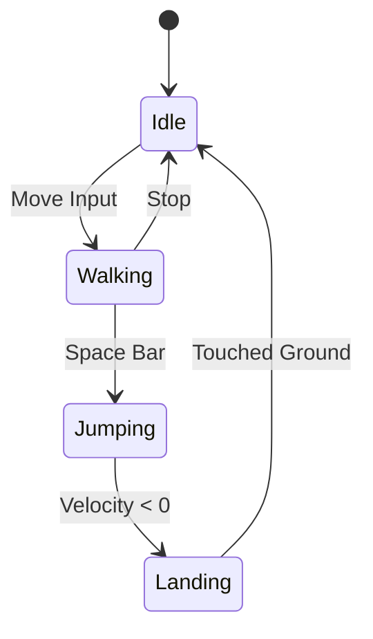
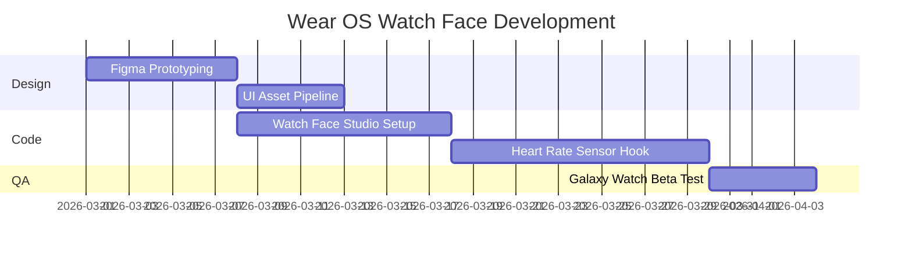
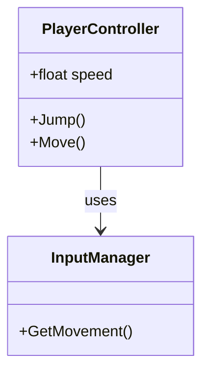

Creating high-quality technical content requires not only clear writing, but also robust visualization tools. In this comprehensive review, we dive deep into the capabilities of the `jekyll-spaceship` plugin integrated directly into our **Hub Architecture** design system.

This isn't just a syntax showcase — it's a demonstration of how an indie developer can craft next-level documentation and interactive lessons with zero bloated dependencies.

---

## 1. Advanced Table Craftsmanship

Tables serve as the backbone of technical documentation. Thanks to `jekyll-spaceship`, we can now construct complex tabular structures that previously required raw HTML.

### Complex Merging (Rowspan & Colspan)

Here is a cellular respiration energy budget table demonstrating both vertical and horizontal cell merges:

| Cellular Respiration Stage | Intermediates | ATP Yield |
| :-------------------------: | :-----------: | :-------: | --- |
| Glycolysis                  | 2 ATP         |           |
| ^^                          | 2 NADH        | 3--5 ATP  |
| Pyruvate Oxidation          | 2 NADH        | 5 ATP     |
| Krebs Cycle                 | 2 ATP         |           |
| ^^                          | 6 NADH        | 15 ATP    |
| ^^                          | 2 FADH        | 3 ATP     |
| **Total Net Yield**         | **30--32 ATP**|           |     |

### Multiline Text Within Cells

Sometimes parameter descriptions exceed a single line. The `\` character at the end of a line allows smooth text continuation:

| Parameter         | Value    | Description                                                     |
| :---------------- | :------- | :-------------------------------------------------------------- |
| **Render Scale**  | `1.0x`   | Sets the baseline rendering resolution for the main viewport \  |
frame. Reducing this improves frame rates on mobile \
devices at the expense of texture clarity. |
| **Post-Processing** | `ACES` | Employs the Academy Color Encoding System for a \
cinematic film-grade visual tone. |

### Headerless Tables (Chessboard & Grid Layouts)

For Bento cards, table headers are often redundant. Here is an 8x8 chessboard representation:

|--|--|--|--|--|--|--|--|
|♜| |♝|♛|♚|♝|♞|♜|
| |♟|♟|♟| |♟|♟|♟|
|♟| |♞| | | | | |
| |♗| | |♟| | | |
| | | | |♙| | | |
| | | | | |♘| | |
|♙|♙|♙|♙| |♙|♙|♙|
|♖|♘|♗|♕|♔| | |♖|

---

## 2. Mathematics for Gamedev (MathJax)

When documenting shader logic, physics simulation, or camera projections, mathematical rigor is essential. We support full LaTeX notation via MathJax.

### The Rendering Equation

Use inline single dollar signs for formulas: $L_o(p, \omega_o) = L_e(p, \omega_o) + \int_{\Omega} f_r(p, \omega_i, \omega_o) L_i(p, \omega_i) (n \cdot \omega_i) d\omega_i$.

For prominent standalone formulas, use double dollar signs:

$$
E = mc^2
$$

Or continuous probability distributions such as the **Gaussian Normal Distribution**:

$$
f(x | \mu, \sigma^2) = \frac{1}{\sqrt{2\pi\sigma^2}} e^{-\frac{(x-\mu)^2}{2\sigma^2}}
$$

---

## 3. Advanced Diagramming (Mermaid)

Real-time, vector-based architectural visualization without raster PNG artifacts.

### Character State Machine

Critical for clean Unity character controller state transitions:



### Gantt Chart (Production Roadmap)

Planning a Wear OS watch face release cycle:



### Class Diagram



---

## 4. Rich Media Integration

Embedding responsive media without external dependencies or heavy JS frameworks:

### YouTube (Instructional Videos)


### Spotify (Ambient Soundtracks)


---

## 5. Polyfills & Emoji

Numbered lists with custom steps format seamlessly:

\1. Step One (explicit 1) \
\3. Step Two (explicit 3)

Native GitHub-flavored emojis work inline: I love this setup :rocket:! Emojis load cleanly with fallback support.

---

## 6. Hybrid HTML & Bento Card Specifics

When standard Markdown layout is insufficient, custom HTML with embedded Markdown is enabled via `<script type="text/markdown">`.

<div class="banner--translation-warning">
  💡 **Note:** You can combine sophisticated CSS Grid structures with Markdown body content. This enables unique Bento layouts where each card represents an independent technical component.
</div>

---

## 7. Code Copy Action Testing

Code blocks include an automated copy button. Test it with this Unity C# script:

```csharp
using UnityEngine;

// Ultimate code copy button validation
public class CopyTest : MonoBehaviour
{
    [SerializeField] private string message = "Code copied successfully! 🚀";

    void Start()
    {
        Debug.Log(message);
    }
}
```

This interaction is driven by our lightweight Vanilla JS in `script.js` and aligns with the Hub Architecture guidelines.

---

## 8. High-Resolution Responsive Images

To test cross-device visual fidelity and WebP compression:

### 1K Image (1920x1080)


### 2K Image (2560x1440)


### 4K Image (3840x2160)


---

## Conclusion

This marks a complete technical integration. Our blog operates as a lightweight, performant platform for technical writing. By pairing **Vanilla CSS**, **Liquid templating**, and the power of **jekyll-spaceship**, we achieve rich rendering without sacrificing page load speed — Mermaid and MathJax only execute on the pages that actually require them.

**Onward to building tiny worlds for tiny screens!** 🎮✨
