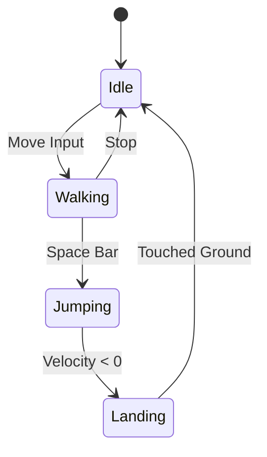
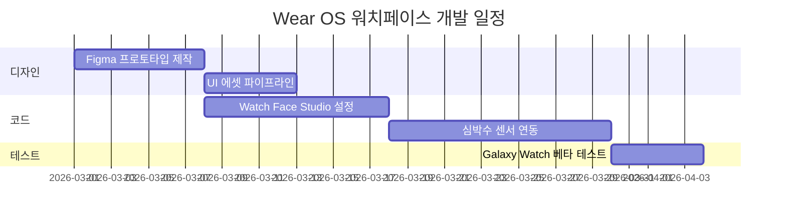
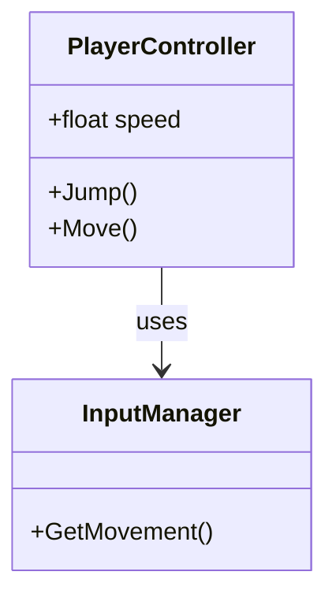

수준 높은 기술 콘텐츠를 작성하기 위해서는 명확한 문장뿐만 아니라 견고한 시각화 도구가 필수적입니다. 이 글에서는 **Hub Architecture** 디자인 시스템에 통합된 `jekyll-spaceship` 플러그인의 핵심 기능을 살펴봅니다.

이는 단순한 구문 테스트를 넘어, 불필요한 의존성 없이 인디 개발자가 직관적인 문서와 기술 수업 자료를 구축하는 방법을 보여줍니다.

---

## 1. 고급 표 구성 (Advanced Tables)

표는 기술 문서의 뼈대 역할을 합니다. `jekyll-spaceship`을 통해 기존 순수 HTML에서만 가능했던 복합 표 레이아웃을 마크다운으로 직접 작성할 수 있습니다.

### 셀 병합 (Rowspan & Colspan)

세포 호흡 에너지 균형을 나타내는 수직 및 수평 셀 병합 표:

|         호흡 단계         |      중간 산물      |    ATP 생성량     |
| :-----------------------: | :-----------------: | :---------------: | --- |
|          해당과정         |        2 ATP        |                   |
|            ^^             |       2 NADH        |     3--5 ATP      |
|      피루브산 산화        |       2 NADH        |       5 ATP       |
|        TCA 회로           |        2 ATP        |                   |
|            ^^             |       6 NADH        |      15 ATP       |
|            ^^             |       2 FADH        |       3 ATP       |
|     **총 순생성량**       |   **30--32 ATP**    |                   |     |

### 셀 내부 다중 행 텍스트 (Multiline Text)

매개변수 설명이 길어질 경우 줄 끝의 `\` 기호로 행을 자연스럽게 이어갈 수 있습니다:

| 매개변수          | 값       | 설명                                                            |
| :---------------- | :------- | :-------------------------------------------------------------- |
| **Render Scale**  | `1.0x`   | 주 뷰포트 프레임의 기본 렌더링 해상도를 결정합니다. \           |
이 값을 낮추면 모바일 기기에서 렌더링 속도가 향상되지만 \
텍스처 선명도가 감소할 수 있습니다. |
| **Post-Processing** | `ACES` | 영화 수준의 색감을 위해 Academy Color Encoding System을 적용합니다. |

### 머리글 없는 표 (체스판 및 그리드)

Bento 카드의 경우 표 머리글이 필요 없는 경우가 많습니다. 8x8 체스판 그리드 예시:

|--|--|--|--|--|--|--|--|
|♜| |♝|♛|♚|♝|♞|♜|
| |♟|♟|♟| |♟|♟|♟|
|♟| |♞| | | | | |
| |♗| | |♟| | | |
| | | | |♙| | | |
| | | | | |♘| | |
|♙|♙|♙|♙| |♙|♙|♙|
|♖|♘|♗|♕|♔| | |♖|

---

## 2. 게임 개발을 위한 수학 수식 (MathJax)

셰이더 계산, 물리 엔진, 투영 행렬을 설명할 때 수학적 표기는 기본입니다. LaTeX 문법을 완벽히 지원합니다.

### 렌더링 방정식

본문 내 인라인 수식은 달러 기호 하나로 감쌉니다: $L_o(p, \omega_o) = L_e(p, \omega_o) + \int_{\Omega} f_r(p, \omega_i, \omega_o) L_i(p, \omega_i) (n \cdot \omega_i) d\omega_i$.

독립된 주요 방정식은 이중 달러 기호를 사용합니다:

$$
E = mc^2
$$

확률 밀도 함수인 **가우스 정규 분포**:

$$
f(x | \mu, \sigma^2) = \frac{1}{\sqrt{2\pi\sigma^2}} e^{-\frac{(x-\mu)^2}{2\sigma^2}}
$$

---

## 3. 고급 다이어그램 (Mermaid)

비트맵 이미지 없이 실시간 벡터 기반 아키텍처 다이어그램을 렌더링합니다.

### 캐릭터 상태 머신

Unity 캐릭터 컨트롤러 상태 전이 구성:



### 간트 차트 (개발 일정 관리)

Wear OS 워치페이스 개발 로드맵:



### 클래스 다이어그램



---

## 4. 리치 미디어 연동

복잡한 프레임워크 없이 반응형 미디어를 임베드합니다:

### YouTube (기술 강좌)


### Spotify (집중을 위한 배경 음악)


---

## 5. 폴리필 및 이모지

커스텀 단계 번호 매기기가 원활하게 작동합니다:

\1. 첫 번째 단계 (명시적 1) \
\3. 두 번째 단계 (명시적 3)

텍스트 내 GitHub 이모지 지원: 안정적인 도구 세트 :rocket:!

---

## 6. 하이브리드 HTML 및 Bento 구조

마크다운 기본 구조 이상의 배치가 필요할 때, `<script type="text/markdown">`을 통해 HTML 내부에 마크다운을 결합합니다.

<div class="banner--translation-warning">
  💡 **안내:** CSS Grid 구조와 마크다운 본문을 결합하여 각 카드가 독립적인 기술 컴포넌트 역할을 수행하는 Bento 레이아웃을 구현할 수 있습니다.
</div>

---

## 7. 코드 복사 기능 (Copy Button)

코드 블록에는 복사 버튼이 자동으로 포함됩니다. Unity C# 예시:

```csharp
using UnityEngine;

// 코드 복사 버튼 동작 확인
public class CopyTest : MonoBehaviour
{
    [SerializeField] private string message = "코드가 복사되었습니다! 🚀";

    void Start()
    {
        Debug.Log(message);
    }
}
```

순수 바닐라 JS(`script.js`)로 작동하여 불필요한 라이브러리 로드를 방지합니다.

---

## 8. 고해상도 반응형 이미지 테스트

기기별 WebP 렌더링 검증:

### 1K 이미지 (1920x1080)


### 2K 이미지 (2560x1440)


### 4K 이미지 (3840x2160)


---

## 결론

모든 기술 통합이 완료되었습니다. **Vanilla CSS**, **Liquid 템플릿**, **jekyll-spaceship**의 조합으로 페이지 로딩 속도를 저해하지 않으면서도 풍부한 기술 콘텐츠를 구현했습니다. Mermaid와 MathJax는 필요한 페이지에서만 지연 로딩됩니다.

**작은 화면을 위한 인터랙티브 디지털 세상을 만들어 갑니다!** 🎮✨
