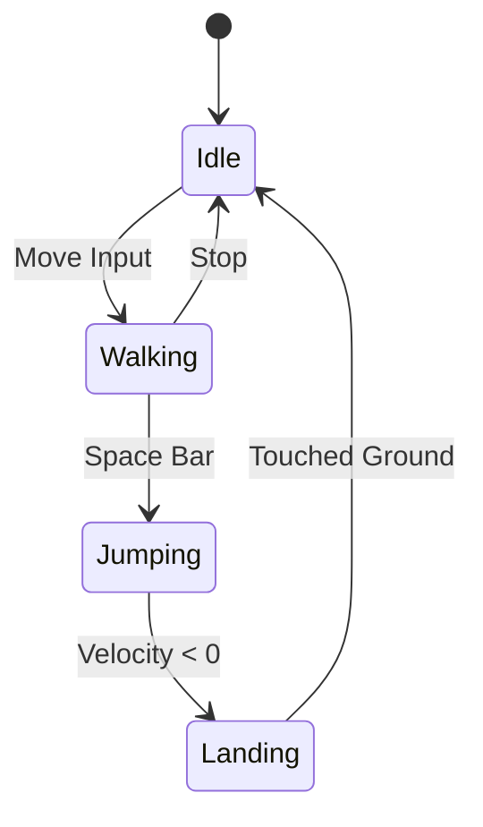
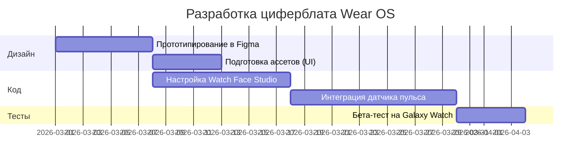
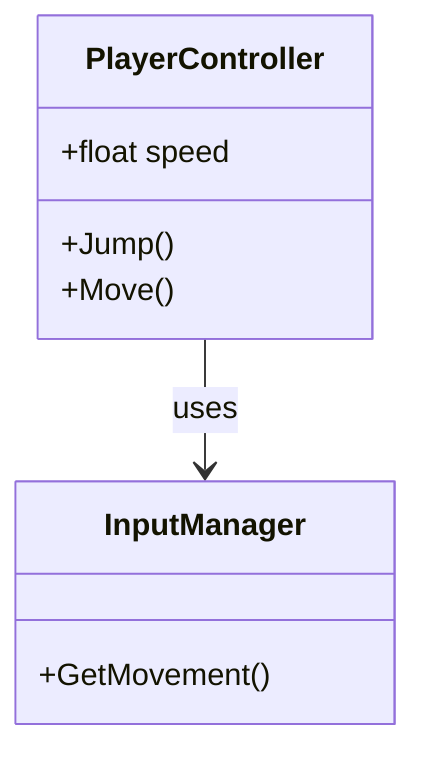

Создание качественного технического контента требует не только ясного текста, но и надёжных инструментов визуализации. В этом подробном обзоре мы погрузимся в возможности плагина `jekyll-spaceship`, интегрированного в нашу дизайн-систему **Hub Architecture**.

Это не просто синтаксический тест — это демонстрация того, как современный инди-разработчик может создавать документацию и уроки нового уровня без лишних зависимостей.

---

## 1. Мастерство Работы с Таблицами

Таблицы — основа технической документации. Благодаря `jekyll-spaceship` мы можем формировать сложные структуры, которые ранее требовали чистого HTML.

### Сложные Объединения (Rowspan & Colspan)

Таблица энергетического баланса клетки, демонстрирующая вертикальное и горизонтальное объединение ячеек:

|      Этап дыхания      | Промежуточные продукты | Выход АТФ (ATP) |
| :--------------------: | :--------------------: | :-------------: | --- |
|        Гликолиз        |         2 ATP          |                 |
|           ^^           |         2 NADH         |    3--5 ATP     |
|   Окисление пирувата   |         2 NADH         |      5 ATP      |
|      Цикл Кребса       |         2 ATP          |                 |
|           ^^           |         6 NADH         |     15 ATP      |
|           ^^           |         2 FADH         |      3 ATP      |
|   **Общий итог**       |     **30--32 ATP**     |                 |     |

### Многострочный текст в ячейках

Иногда описание параметра не помещается в одну строку. Символ `\` в конце строки позволяет продолжить её:

| Параметр          | Значение | Описание                                                         |
| :---------------- | :------- | :--------------------------------------------------------------- |
| **Render Scale**  | `1.0x`   | Определяет базовое разрешение рендеринга для основного кадра. \  |
Снижение этого значения повысит производительность на мобильных \
устройствах, но сделает изображение менее чётким. |
| **Post-Processing** | `ACES` | Использует Academy Color Encoding System для \
кинематографической цветопередачи. |

### Беззаголовочные таблицы (Шахматный вид)

Для Bento-карточек заголовок таблицы часто не требуется. Например, для визуализации сетки или карты:

|--|--|--|--|--|--|--|--|
|♜| |♝|♛|♚|♝|♞|♜|
| |♟|♟|♟| |♟|♟|♟|
|♟| |♞| | | | | |
| |♗| | |♟| | | |
| | | | |♙| | | |
| | | | | |♘| | |
|♙|♙|♙|♙| |♙|♙|♙|
|♖|♘|♗|♕|♔| | |♖|

---

## 2. Математика для Геймдева (MathJax)

При описании шейдеров, физики и проекций не обойтись без математики. Мы поддерживаем синтаксис LaTeX через MathJax.

### Уравнение рендеринга

Используйте одинарный символ доллара для встроенных формул: $L_o(p, \omega_o) = L_e(p, \omega_o) + \int_{\Omega} f_r(p, \omega_i, \omega_o) L_i(p, \omega_i) (n \cdot \omega_i) d\omega_i$.

А для отдельных ключевых выражений — двойные доллары:

$$
E = mc^2
$$

Или более сложные формулы, например, **Нормальное Распределение Гаусса**:

$$
f(x | \mu, \sigma^2) = \frac{1}{\sqrt{2\pi\sigma^2}} e^{-\frac{(x-\mu)^2}{2\sigma^2}}
$$

---

## 3. Продвинутая Диаграммистика (Mermaid)

Векторная визуализация архитектуры в реальном времени без использования PNG-файлов.

### Стейт-машина персонажа

Критически важно для управления состояниями персонажа в Unity:



### Диаграмма Ганта (План Разработки)

Планирование релиза циферблата для Wear OS:



### Классовая Диаграмма



---

## 4. Мультимедийная Интеграция

Вставка адаптивных медиа-блоков без лишних скриптов:

### YouTube (Обучающие видео)


### Spotify (Для фонового настроения)


---

## 5. Полифилы и Эмодзи

Нумерованные списки с кастомными шагами форматируются гладко:

\1. Первый шаг (явно 1) \
\3. Второй шаг (явно 3)

Эмодзи поддерживаются прямо в тексте: отличный инструмент :rocket:!

---

## 6. Гибридный HTML и Bento-карточки

Когда стандартного Markdown недостаточно, используется HTML со встроенным Markdown через `<script type="text/markdown">`.

<div class="banner--translation-warning">
  💡 **Важно:** Вы можете комбинировать структуры CSS Grid с телом Markdown. Это позволяет создавать гибкие Bento-раскладки, где каждый блок автономен.
</div>

---

## 7. Тестирование Копирования Кода (Copy Button)

Блоки кода оснащены автоматической кнопкой копирования. Проверьте её на этом скрипте Unity C#:

```csharp
using UnityEngine;

// Тест кнопки копирования кода
public class CopyTest : MonoBehaviour
{
    [SerializeField] private string message = "Код успешно скопирован! 🚀";

    void Start()
    {
        Debug.Log(message);
    }
}
```

Кнопка работает на нативном Vanilla JS в `script.js` и полностью соответствует эстетике Hub Architecture.

---

## 8. Адаптивные Изображения Высокого Разрешения

Для проверки рендеринга и сжатия WebP на различных устройствах:

### 1K Изображение (1920x1080)


### 2K Изображение (2560x1440)


### 4K Изображение (3840x2160)


---

## Заключение

Интеграция завершена. Наш блог функционирует как лёгкая, производительная платформа для технических лонгридов. Сочетая **Vanilla CSS**, **Liquid** и плагин **jekyll-spaceship**, мы обеспечиваем чистый рендеринг без замедления загрузки страниц: Mermaid и MathJax подгружаются только там, где они действительно нужны.

**Вперёд к созданию миниатюрных миров для небольших экранов!** 🎮✨
