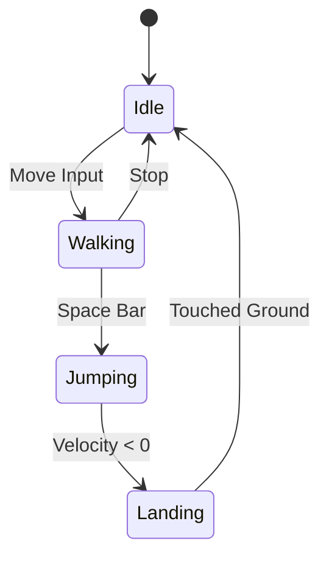
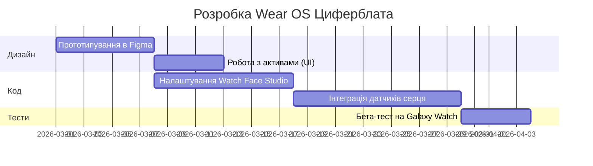
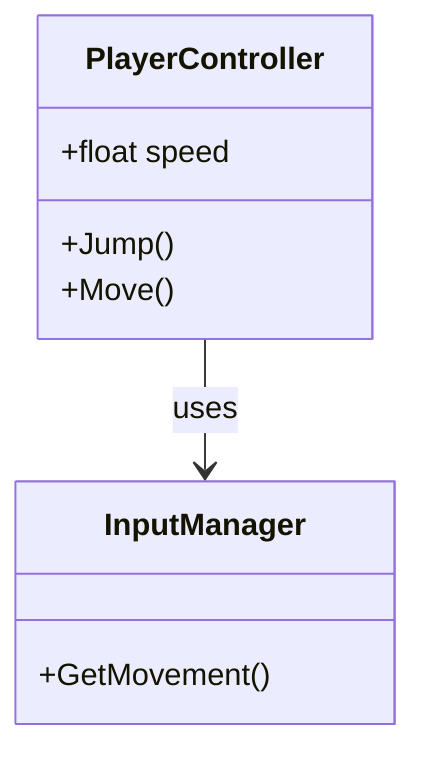

# 🚀 Ультимативний Технічний Лонгрід

Створення якісного технічного контенту вимагає не лише гарного тексту, а й потужних інструментів візуалізації. У цьому детальному огляді ми зануримося у можливості плагіна `jekyll-spaceship`, інтегрованого у нашу дизайн-систему **Bento UI**.

Це не просто тест — це демонстрація того, як сучасний інді-розробник може створювати документацію та уроки нового рівня.

---

## 1. Майстерність Роботи з Таблицями

Таблиці — це хребет технічної документації. Завдяки `jekyll-spaceship`, ми тепер можемо створювати складні структури, які раніше потребували чистого HTML.

### Складні Об'єднання (Rowspan & Colspan)

Ось таблиця енергетичного балансу клітини, що демонструє вертикальне та горизонтальне об'єднання:

|      Етап дихання      | Проміжні продукти | Вихід АТФ (ATP) |
| :--------------------: | :---------------: | :-------------: | --- |
|        Гліколіз        |       2 ATP       |                 |
|           ^^           |      2 NADH       |    3--5 ATP     |
|   Окиснення пірувату   |      2 NADH       |      5 ATP      |
|      Цикл Кребса       |       2 ATP       |                 |
|           ^^           |      6 NADH       |     15 ATP      |
|           ^^           |      2 FADH       |      3 ATP      |
| **Загальний підсумок** |  **30--32 ATP**   |                 |     |

### Багаторядковий текст у комірках

Іноді опис параметра не вміщується в один рядок. Символ `\` в кінці рядка дозволяє продовжити його:

| Параметр         | Значення | Опис                                                            |
| :--------------- | :------- | :-------------------------------------------------------------- |
| **Render Scale** | `1.0x`   | Визначає базову роздільну здатність рендерингу для основного \  |

кадру. Зменшення цього значення покращить продуктивність на \
мобільних пристроях, але розмиє картинку. |
| **Post-Processing** | `ACES` | Використовує Academy Color Encoding System для \
кінематографічного вигляду гри. |

### Беззаголовкові таблиці (Шаховий вигляд)

Для Bento-карток іноді заголовок таблиці просто не потрібен. Наприклад, для візуалізації сітки чи карти:

|--|--|--|--|--|--|--|--|
|♜| |♝|♛|♚|♝|♞|♜|
| |♟|♟|♟| |♟|♟|♟|
|♟| |♞| | | | | |
| |♗| | |♟| | | |
| | | | |♙| | | |
| | | | | |♘| | |
|♙|♙|♙|♙| |♙|♙|♙|
|♖|♘|♗|♕|♔| | |♖|

---

## 2. Математика для Геймдева (MathJax)

Якщо ви пишете про Unity та шейдери, вам не обійтися без математики. Ми підтримуємо синтаксис LaTeX.

### Рівняння рендерингу

Використовуйте одиничний символ долара для інлайнової математики: $L_o(p, \omega_o) = L_e(p, \omega_o) + \int_{\Omega} f_r(p, \omega_i, \omega_o) L_i(p, \omega_i) (n \cdot \omega_i) d\omega_i$.

А для важливих формул використовуйте подвійні долари:

$$
E = mc^2
$$

Або щось складніше — як **Нормальний Розподіл**:

$$
f(x | \mu, \sigma^2) = \frac{1}{\sqrt{2\pi\sigma^2}} e^{-\frac{(x-\mu)^2}{2\sigma^2}}
$$

---

## 3. Просунута Діаграмістика (Mermaid)

Візуалізація архітектури в реальному часі без використання PNG-зображень.

### Стейт-машина персонажа

Для Unity розробки це критично:



### Діаграма Ганта (План Розробки)

Планування релізу Wear OS додатка:



### Класова Діаграма



---

## 4. Мультимедійний Екосистемний Досвід

Забули як вставляти відео? Просто вставте лінк в блок зображення!

### YouTube (Навчальні відео)


### Spotify (Для фонового настрою)


---

## 5. Поліфіли та Емодзі

Списки тепер автоматично обробляються правильно, навіть якщо ми хочемо екранувати їх:

\1. Перший пункт (фактично 1) \
\3. Другий пункт (фактично 3)

А емодзі стали частиною тексту: я обожнюю цей плагін :rocket:! Ми додали підтримку GitHub-flavored емодзі, тому вони завантажуються з надійного CDN.

---

## 6. Гібридний HTML та Bento Специфіка

Коли стандартного Markdown замало, ми використовуємо HTML з Markdown всередині завдяки `<script type="text/markdown">`.

<div class="banner--translation-warning">
  💡 **Важливо:** Ви можете комбінувати складні Grid-структури з Markdown контентом. Це дозволяє створювати унікальні Bento-лейаути, де кожна комірка — це окремий технічний блок.
</div>

---

## 7. Тестування Копіювання Коду (Copy Button)

Наші блоки коду тепер мають автоматичну кнопку копіювання. Спробуйте скопіювати цей C# скрипт для Unity:

```csharp
using UnityEngine;

// Ультимативний тест копіювання коду
public class CopyTest : MonoBehaviour
{
    [SerializeField] private string message = "Код скопійовано успішно! 🚀";

    void Start()
    {
        Debug.Log(message);
    }
}
```

Ця функція працює завдяки нашому Vanilla JS в `script.js` (§7) і ідеально вписується в Bento UI.

---

## 8. Тестування роздільної здатності зображень (Responsive Images)

Для перевірки оптимізації та рендерингу на різних пристроях ми додаємо зображення у різних форматах (1K, 2K, 4K). Завдяки `jekyll-webp`, ці зображення будуть автоматично оптимізовані в майбутньому (якщо ми їх збережемо локально), а поки використовуємо тестові плейсхолдери.

### 1K Зображення (1920x1080)


### 2K Зображення (2560x1440)


### 4K Зображення (3840x2160)


---

## Висновок

Це був довгий шлях до ідеальної інтеграції. Тепер наш блог — це справжній "космічний корабель" (Spaceship) для технічного контенту. Ми поєднали **Vanilla CSS**, **Liquid** та потужність **Spaceship**, не пожертвувавши швидкістю завантаження (адже Mermaid та MathJax завантажуються лише там, де вони потрібні).

**Вперед до нових висот розробки!** 🎮✨
