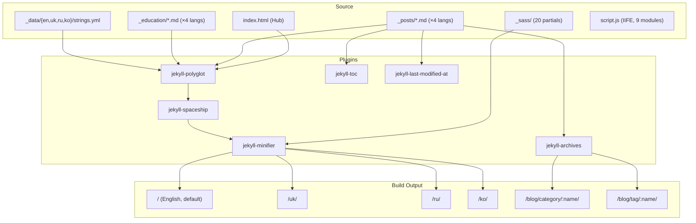

> Цей файл — ПОВНИЙ КОНТЕКСТ проекту для передачі іншому ШІ.
> Автор: Ihor Sivochka — Indie Game Developer, Зміїв, UA.
> Оновлено: 2026-03-01

---

## 🏗️ СИСТЕМНА АРХІТЕКТУРА



---

## 🔧 ТЕХНІЧНЕ ЯДРО

- **Jekyll 4.4** — Static Site Generator
- **Polyglot** — Квадрилінгвальна збірка (EN, UK, RU, KO). DRY: один `index.html`, текст в `_data/[lang]/strings.yml`
- **PWA (Workbox)** — Service Worker + `manifest.json`. Офлайн-перший підхід
- **Spaceship** — Mermaid діаграми, MathJax формули, YouTube/Spotify embeds
- **jekyll-toc** — Автоматичний зміст (включається `toc: true` у front matter)
- **jekyll-archives** — Автосторінки `/blog/category/:name/` та `/blog/tag/:name/`
- **jekyll-last-modified-at** — `dateModified` з git log (показується тільки якщо ≠ `datePublished`)
- **GoatCounter** — Privacy-first analytics (Zero cookies, no GDPR)
- **Performance Budget** — JS < 20KB, CSS < 30KB (перевіряється в CI)

---

## 📂 КЛЮЧОВІ ФАЙЛИ

| Файл                           | Призначення                                          |
| ------------------------------ | ---------------------------------------------------- |
| `_config.yml`                  | Plugins, polyglot, pagination, TOC, archives config  |
| `_config_dev.yml`              | Dev overlay: без мінімізації, без PWA                |
| `script.js`                    | Єдиний JS файл (IIFE з 9 модулями + SW registration) |
| `assets/css/styles.scss`       | SCSS manifest: 20 партіалів через `@use`             |
| `manifest.json`                | PWA Web App Manifest                                 |
| `.github/workflows/jekyll.yml` | CI: build → HTML Proofer → Bundle Check → deploy     |

---

## 🧩 SCSS АРХІТЕКТУРА (20 партіалів)

```
styles.scss imports:
  variables → base → layout → grid → cards
  → card-{bio,studio,webgl,stack,shrine,python,feed}
  → hub-pages → post → search → components
  → spaceship → footer → toc → archive
```

**Правила:**

- Один партіал = один компонент. Без перетинання відповідальності
- Всі кольори/розміри через CSS custom properties з `_variables.scss`
- **Жодних inline стилів** (окрім `view-transition-name` які залежать від Liquid)
- Grid лейаут тільки через `grid-template-areas` в `_grid.scss`

---

## 📜 script.js МОДУЛІ

| §   | Назва            | Що робить                                     |
| --- | ---------------- | --------------------------------------------- |
| 1   | Scroll Fade-In   | `IntersectionObserver` для `.fade-in` карток  |
| 2   | WebGL Overlay    | Click-to-load iframe для Unity демо           |
| 3   | Card Tilt        | 3D перспектива на hover (`bento-tilt-target`) |
| 4   | Reading Progress | Scroll-based прогрес-бар                      |
| 5   | Copy Code        | Click-to-copy на блоках коду                  |
| 6   | Navbar Scroll    | Show/hide навбар по напрямку скролу           |
| 7   | View Transitions | Client-side `startViewTransition()`           |
| 8   | Search           | Повнотекстовий пошук з `search.json`          |
| 9   | Lang Switch      | Збереження `preferred_lang` в localStorage    |
| —   | SW               | Service Worker реєстрація (поза IIFE)         |

---

## 🔍 SEO & STRUCTURED DATA

- **BlogPosting JSON-LD** — на кожному пості: `headline`, `datePublished`, `dateModified`, `author`, `url`
- **Article JSON-LD** — на education: те саме
- **BreadcrumbList JSON-LD** — на постах, education, archives: Hub → Section → Page
- **hreflang** — автоматично через `jekyll-polyglot` (4 мови)
- **Sitemap** — `/sitemap.xml` через `jekyll-sitemap`
- **RSS** — через `jekyll-feed`
- **apple-touch-icon** — для iOS PWA

---

## 🤖 AI-TO-AI HANDOFF

Щоб швидко увійти в проект:

1. **Прочитай `gemini3rules.md`** — це "Конституція". Не порушуй
2. **Перевір `strings.yml`** — перед додаванням UI ключів перевір всі 4 словники
3. **JS тільки в `script.js`** — всередині IIFE, ES5 синтаксис (`function()`, не `=>`)
4. **CSS тільки в `_sass/`** — через `@use` в `styles.scss`. Жодних inline стилів
5. **Пости × 4 мови** — кожен пост має 4 мовні версії з **однаковим** `permalink`
6. **`category` + `tags`** — кожен пост = archive pages через `jekyll-archives`

---

## ⚠️ ОБМЕЖЕННЯ

1. **DRY 100%** — Жодного дубляжу. Liquid + Dictionaries
2. **Zero Frameworks** — Тільки Vanilla JS + Pure CSS + Liquid
3. **Performance** — JS < 20KB, CSS < 30KB (CI перевіряє)
4. **Hub Parity** — `index.html` єдине джерело структури головної
5. **No `jekyll-webp`** — Ламає все. Виключено per user request

---

_Every line of code is a design decision. Keep it lean._
