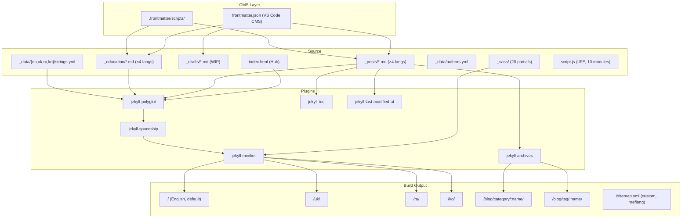

> Цей файл — ПОВНИЙ КОНТЕКСТ проекту для передачі іншому ШІ.
> Автор: Ihor Sivochka — Indie Game Developer, Зміїв, UA.
> Оновлено: 2026-03-05

---

## 🏗️ СИСТЕМНА АРХІТЕКТУРА


```mermaid
graph TD
    subgraph CMS Layer
        FM["frontmatter.json (VS Code CMS)"]
        Scripts[".frontmatter/scripts/"]
    end

    subgraph Source
        H["index.html (Hub)"]
        P["_posts/*.md (×4 langs)"]
        Drafts["_drafts/*.md (WIP)"]
        E["_education/*.md (×4 langs)"]
        D["_data/{en,uk,ru,ko}/strings.yml"]
        Authors["_data/authors.yml"]
        S["_sass/ (20 partials)"]
        JS["script.js (IIFE, 10 modules)"]
    end

    subgraph Plugins
        Poly[jekyll-polyglot]
        Space[jekyll-spaceship]
        TOC[jekyll-toc]
        Archives[jekyll-archives]
        LMA[jekyll-last-modified-at]
        Min[jekyll-minifier]
    end

    subgraph Build Output
        DirEN["/ (English, default)"]
        DirUK["/uk/"]
        DirRU["/ru/"]
        DirKO["/ko/"]
        CatPages["/blog/category/:name/"]
        TagPages["/blog/tag/:name/"]
        Sitemap["/sitemap.xml (custom, hreflang)"]
    end

    FM --> P & E & Drafts
    Scripts --> P & E
    H & P & E & D --> Poly
    S --> Min
    P --> TOC & Archives & LMA
    Poly --> Space
    Space --> Min
    Min --> DirEN & DirUK & DirRU & DirKO
    Archives --> CatPages & TagPages
```

---

## 🔧 ТЕХНІЧНЕ ЯДРО

- **Jekyll 4.4** — Static Site Generator
- **Frontmatter CMS** — VS Code extension як headless CMS. Керує front matter, контентом, зображеннями та Git прямо з редактора. Файл конфігурації: `frontmatter.json`
- **Polyglot** — Квадрилінгвальна збірка (EN, UK, RU, KO). DRY: один `index.html`, текст в `_data/[lang]/strings.yml`
- **PWA (Workbox)** — Service Worker + `manifest.json`. Офлайн-перший підхід
- **Spaceship** — Mermaid діаграми, MathJax формули, YouTube/Spotify embeds
- **jekyll-toc** — Автоматичний зміст (включається `toc: true` у front matter)
- **Hierarchical Breadcrumbs** — Система навігації за замовчуванням (Hub → Section → Category → Article). Замінила кнопки "Назад"
- **jekyll-archives** — Автосторінки `/blog/category/:name/` та `/blog/tag/:name/`
- **jekyll-last-modified-at** — `dateModified` з git log (показується тільки якщо ≠ `datePublished`)
- **CGM Header Style** — Мінімалістичні заголовки статтей (Header | Date | Read Time). Без декоративних емодзі
- **GoatCounter** — Privacy-first analytics (Zero cookies, no GDPR)
- **Performance Budget** — JS < 20KB, CSS < 30KB. **Rect Caching** for zero layout thrashing
- **Modern A11y & UX** — Responsive safe-area hygiene via dynamic SCSS tokens + skip-link

---

## 🌐 QUADRILINGUAL SYNC (EN · UK · RU · KO)

> Повний workflow: `.agents/workflows/i18n-sync.md` (команда `/i18n-sync`)

### Золоте правило

**Один permalink. Чотири файли. Всі в синхроні.**
EN — завжди джерело правди. `permalink` — ОДНАКОВИЙ у всіх 4 файлах.

### Quick Reference

| Суфікс файлу | `lang:` | URL-префікс | Strings file           |
| ------------ | ------- | ----------- | ---------------------- |
| `-en.md`     | `en`    | _(немає)_   | `_data/en/strings.yml` |
| `-uk.md`     | `uk`    | `/uk/`      | `_data/uk/strings.yml` |
| `-ru.md`     | `ru`    | `/ru/`      | `_data/ru/strings.yml` |
| `-ko.md`     | `ko`    | `/ko/`      | `_data/ko/strings.yml` |

### Структура файлу посту (обов'язково для всіх 4)

```yaml
---
layout: post
title: "Назва"
description: "SEO опис ~160 chars."  # обов'язково!
date: YYYY-MM-DD
lang: en          # en / uk / ru / ko
permalink: /blog/my-post/           # ОДНАКОВИЙ у всіх 4!
author: ihor
categories: gamedev
tags: [unity, csharp]
published: true
---
```

### UI Strings — як додати новий ключ

1. Додати ключ у `_data/en/strings.yml` (EN-значення)
2. Скопіювати ключ у `uk`, `ru`, `ko` strings.yml → перекласти
3. Використати у Liquid: `{{ site.data[page.lang].strings.my_key }}`

> ⚠️ Відсутній ключ у будь-якому strings.yml = **пусте місце** на тій мові. Завжди синхронізуй всі 4 файли.

### Checklist перед пушем

- [ ] Всі 4 файли мають **однаковий `permalink`**
- [ ] Всі 4 файли мають `published: true`
- [ ] Всі нові UI ключі додані у всі 4 `strings.yml`
- [ ] `description` є у кожному файлі
- [ ] `author: ihor` виставлено
- [ ] `categories` з pre-seeded списку (`frontmatter.json`)

### Як polyglot генерує URL

```
jekyll-polyglot:
  /blog/my-post/     ← EN (default)
  /uk/blog/my-post/  ← UK
  /ru/blog/my-post/  ← RU
  /ko/blog/my-post/  ← KO
hreflang auto-inject: на основі збігу permalink значень
```

---

## 📂 КЛЮЧОВІ ФАЙЛИ

| Файл                                      | Призначення                                                  |
| ----------------------------------------- | ------------------------------------------------------------ |
| `_config.yml`                             | Plugins, polyglot, pagination, TOC, archives config          |
| `_config_dev.yml`                         | Dev overlay: без мінімізації, без PWA                        |
| `frontmatter.json`                        | Frontmatter CMS: content types, snippets, scripts, sorting   |
| `.frontmatter/scripts/create-translations.js` | CMS action: auto-stub uk/ru/ko translation files         |
| `.frontmatter/scripts/check-images.js`    | CMS action: report non-WebP images in assets/images/         |
| `script.js`                               | Єдиний JS файл (IIFE з 10 модулями + SW registration)        |
| `assets/css/styles.scss`                  | SCSS manifest: 20 партіалів через `@use`                     |
| `sitemap.xml`                             | Кастомний XML сайтмап з hreflang для 4 мов                   |
| `manifest.json`                           | PWA Web App Manifest                                         |
| `_data/authors.yml`                       | Профілі авторів (читається Frontmatter CMS data file picker) |
| `.github/workflows/jekyll.yml`            | CI: build → HTML Proofer → Bundle Check → deploy             |

---

## ✏️ FRONTMATTER CMS

**Розширення VS Code:** [Front Matter CMS](https://frontmatter.codes/) — headless CMS без сервера.

### Content Types

| Type          | Folder        | Обов'язкові поля                                                |
| ------------- | ------------- | --------------------------------------------------------------- |
| **Post**      | `_posts/`     | layout(hidden), title, description, date, lang, permalink, author, image, categories, tags, published |
| **Post**      | `_drafts/`    | Ті самі поля. `published: false` → не збирається Jekyll        |
| **Education** | `_education/` | title, description, excerpt, author, lang, permalink, level, sort_order, tags, image, published |

- **`author`** — data file picker з `_data/authors.yml`. Не вводити вручну
- **`image`** — visual picker з `assets/images/`
- **`published`** — draft toggle (Jekyll `published: false` виключає файл зі збірки)
- **`level`** — `beginner | intermediate | advanced` (для Education)

### Snippets у редакторі (14 шт.)

| Категорія  | Назви                                                         |
| ---------- | ------------------------------------------------------------- |
| Spaceship  | YouTube embed, Local video, Mermaid diagram, MathJax block, Markdown table |
| Polyglot   | Translation note (посилання на всі 4 мови)                    |
| Callouts   | Info, Warning                                                 |
| Code       | Liquid raw block, Rouge highlight (linenos)                   |
| Media      | WebP `<figure>` (lazy, width, height, figcaption)             |
| Links      | Internal post (relative_url), Jekyll include tag              |
| SEO        | Article JSON-LD schema                                        |

### Custom Scripts (CMS Actions)

| Скрипт                     | Тип         | Дія                                                     |
| -------------------------- | ----------- | ------------------------------------------------------- |
| `create-translations.js`   | content     | Кнопка у панелі → stub-файли для uk/ru/ko зі збереженням slug/permalink |
| `check-images.js`          | mediaFolder | Сканує assets/images/ → список non-WebP файлів         |

### Workflow: новий пост

1. VS Code → Front Matter panel → **New content** → Post або Education
2. Заповнити поля (title, lang=en, permalink, categories, tags)
3. Написати контент, вставляти blocks через **Snippets**
4. Кнопка **🌐 Create Missing Translations** → стаби uk/ru/ko
5. Перекласти, виставити `published: true` у всіх 4 файлах
6. Git commit — автоформат `content: {{title}} [{{date}}]`

---

## 🧩 SCSS АРХІТЕКТУРА (20 партіалів)

```
styles.scss imports:
  variables → base → layout → grid → cards
  → card-{bio,studio,webgl,stack,shrine,python,feed}
  → hub-pages → post → search → components
  → spaceship → footer → toc → archive
```

**Правила:**

- Один партіал = один компонент. Без перетинання відповідальності
- Всі кольори/розміри через CSS custom properties з `_variables.scss`
- Жодних inline стилів (окрім `view-transition-name` які залежать від Liquid)
- **Safe-Area Hygiene** — Всі відступи базуються на `env(safe-area-inset-top)` через змінні в `_variables.scss`
- Grid лейаут тільки через `grid-template-areas` в `_grid.scss`

---

## 📜 script.js МОДУЛІ

| §   | Назва            | Що робить                                       |
| --- | ---------------- | ----------------------------------------------- |
| 1   | Scroll Fade-In   | `IntersectionObserver` для `.fade-in` карток    |
| 2   | WebGL Overlay    | Click-to-load iframe для Unity демо             |
| 3   | Card Tilt        | 3D перспектива на hover (Rect Caching, Zero-GC) |
| 4   | Reading Progress | Throttled scroll-based прогрес-бар              |
| 5   | Copy Code        | Click-to-copy на блоках коду                    |
| 6   | Navbar Scroll    | Show/hide навбар по напрямку скролу             |
| 7   | View Transitions | Client-side `startViewTransition()`             |
| 8   | Search           | Повнотекстовий пошук з `search.json`            |
| 9   | Lang Switch      | Збереження `preferred_lang` в localStorage      |
| 10  | Rect Caching     | Zero-GC layout thrashing prevention (120Hz+)    |
| —   | SW               | Service Worker реєстрація (поза IIFE)           |

---

## 🔍 SEO, E-E-A-T & STRUCTURED DATA

- **E-E-A-T (Досвід, Експертність, Авторитетність, Достовірність):**
  - Головна сторінка (`is_home: true`) рендерить розширені JSON-LD схеми `@type: Person` (з `jobTitle`, `sameAs` лінками на соц. мережі) та `@type: WebSite` для посилення авторського авторитету (Knowledge Graph).
- **BlogPosting & Article JSON-LD** — на кожному пості та tutorials: `headline`, `datePublished`, `dateModified`, `author`, `url`. Уніфіковано через `_includes/metadata/json-ld.html`.
- **BreadcrumbList JSON-LD** — на всіх сторінках (Hub → Section → Category → Page) для ієрархічної навігації.
- **Локалізовані Meta Descriptions (Polyglot + SEO Tag):** `jekyll-seo-tag` генерує метатеги англійською за замовчуванням. Щоб уникнути дублювання, ми динамічно присвоюємо `` у `head.html` *перед* викликом ``.
- **Home Page Detection:** Через генерацію шляхів плагіном Polyglot (`/uk/index.html`), перевірка URL (`page.url == '/'`) ненадійна. Використовуємо кастомний front matter `is_home: true` у `index.html` для інжекції схем.
- **Semantic HTML & CLS Prevention:**
  - Головна сторінка: незалежний контент загорнуто в `<article>`, а секції (Stack, Shrine, WebGL) — в `<section>`.
  - Усі `` (особливо ліниво завантажені, `loading="lazy"`) мають явно задані `width` та `height`, щоб зарезервувати місце і запобігти Cumulative Layout Shift (CLS).
- **hreflang** — автоматично через `jekyll-polyglot` для правильного розподілу 4 мов у Google Search.
- **Кастомний Sitemap** — `sitemap.xml` (не `jekyll-sitemap`!) генерує XML з `<xhtml:link hreflang>` для всіх 4 мов. Виключений з мінімізації в `jekyll-minifier`.
- **RSS Feed** — через `jekyll-feed` (`feed.xml`). Виключений з мінімізації.
- **Accessibility** — Skip-link "Перейти до основного вмісту" (visually hidden, focus-visible) з підтримкою `prefers-reduced-motion`.

---

## 🤖 AI-TO-AI HANDOFF

Щоб швидко увійти в проект:

1. **Прочитай `gemini3rules.md`** — це "Конституція". Не порушуй
2. **CMS-First підхід** — новий контент через Frontmatter CMS (VS Code). Поле `author` береться з `_data/authors.yml` через data file picker
3. **Переклади** — використовуй `.frontmatter/scripts/create-translations.js` (CMS action) для авто-генерації stub-файлів
4. **Перевір `strings.yml`** — перед додаванням UI ключів перевір всі 4 словники
5. **JS тільки в `script.js`** — всередині IIFE, ES5 синтаксис
6. **CSS тільки в `_sass/`** — через `@use` в `styles.scss`. Жодних inline стилів
7. **Пости × 4 мови** — кожен пост має 4 мовні версії з **однаковим** `permalink`
8. **`category` + `tags`** — кожен пост = archive pages через `jekyll-archives`
9. **CGM Style Guide** — Статті без кнопок "Назад" та емодзі-префіксів. Тільки чистий текст та ієрархічні крихти
10. **Sitemap** — НЕ використовуй `jekyll-sitemap`. Кастомний `sitemap.xml` вже є та виключений з мінімізації

---

## ⚠️ ОБМЕЖЕННЯ

1. **DRY 100%** — Жодного дубляжу. Liquid + Dictionaries
2. **Zero Frameworks** — Тільки Vanilla JS + Pure CSS + Liquid
3. **Performance** — JS < 20KB, CSS < 30KB (CI перевіряє)
4. **Hub Parity** — `index.html` єдине джерело структури головної
5. **No `jekyll-webp`** — Ламає все. Виключено per user request
6. **No `jekyll-sitemap`** — Конфліктує з кастомним `sitemap.xml`. Виключено
7. **jekyll-minifier виключення** — `sitemap.xml` і `feed.xml` **обов'язково** в списку `exclude` мінімізатора, інакше Google не зможе прочитати XML
8. **Node.js required** — для `.frontmatter/scripts/` (CMS custom actions)

---

_Every byte matters. Every pixel counts. Build it native._
