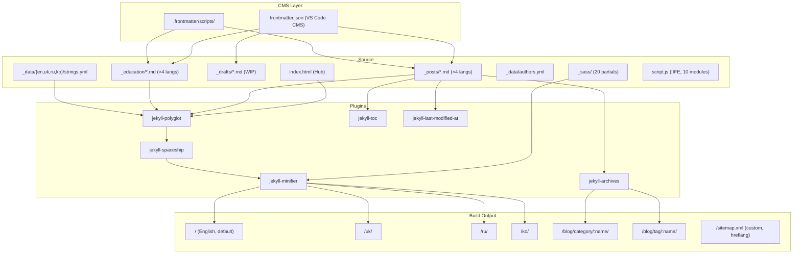

> This file is the FULL CONTEXT of the project for handover to another AI.
> Author: Ihor Sivochka — Indie Game Developer, Zmiiv, UA.
> Updated: 2026-03-05

---

## 🏗️ SYSTEM ARCHITECTURE


```mermaid
graph TD
    subgraph CMS Layer
        FM["frontmatter.json (VS Code CMS)"]
        Scripts[".frontmatter/scripts/"]
    end

    subgraph Source
        H["index.html (Hub)"]
        P["_posts/*.md (×4 langs)"]
        Drafts["_drafts/*.md (WIP)"]
        E["_education/*.md (×4 langs)"]
        D["_data/{en,uk,ru,ko}/strings.yml"]
        Authors["_data/authors.yml"]
        S["_sass/ (20 partials)"]
        JS["script.js (IIFE, 10 modules)"]
    end

    subgraph Plugins
        Poly[jekyll-polyglot]
        Space[jekyll-spaceship]
        TOC[jekyll-toc]
        Archives[jekyll-archives]
        LMA[jekyll-last-modified-at]
        Min[jekyll-minifier]
    end

    subgraph Build Output
        DirEN["/ (English, default)"]
        DirUK["/uk/"]
        DirRU["/ru/"]
        DirKO["/ko/"]
        CatPages["/blog/category/:name/"]
        TagPages["/blog/tag/:name/"]
        Sitemap["/sitemap.xml (custom, hreflang)"]
    end

    FM --> P & E & Drafts
    Scripts --> P & E
    H & P & E & D --> Poly
    S --> Min
    P --> TOC & Archives & LMA
    Poly --> Space
    Space --> Min
    Min --> DirEN & DirUK & DirRU & DirKO
    Archives --> CatPages & TagPages
```

---

## 🔧 TECHNICAL CORE

- **Jekyll 4.4** — Static Site Generator
- **Frontmatter CMS** — VS Code extension as a headless CMS. Manages front matter, content, images, and Git directly from the editor. Configuration file: `frontmatter.json`
- **Polyglot** — Quadrilingual build (EN, UK, RU, KO). DRY: one `index.html`, text in `_data/[lang]/strings.yml`
- **PWA (Workbox)** — Service Worker + `manifest.json`. Offline-first approach
- **Spaceship** — Mermaid diagrams, MathJax formulas, YouTube/Spotify embeds
- **jekyll-toc** — Automatic Table of Contents (enabled by `toc: true` in front matter)
- **Hierarchical Breadcrumbs** — Default navigation system (Hub → Section → Category → Article). Replaced "Back" buttons
- **jekyll-archives** — Auto-generated pages for `/blog/category/:name/` and `/blog/tag/:name/`
- **jekyll-last-modified-at** — `dateModified` from git log (shown only if ≠ `datePublished`)
- **CGM Header Style** — Minimalist article headers (Author | Date | Read Time). No decorative emojis
- **GoatCounter** — Privacy-first analytics (Zero cookies, no GDPR)
- **Performance Budget** — JS < 20KB, CSS < 30KB. **Rect Caching** for zero layout thrashing
- **Modern A11y & UX** — Responsive safe-area hygiene via dynamic SCSS tokens + skip-link

---

## 🌐 QUADRILINGUAL SYNC (EN · UK · RU · KO)

> Full workflow: `.agents/workflows/i18n-sync.md` (command `/i18n-sync`)

### Golden Rule

**One permalink. Four files. All in sync.**
EN is always the source of truth. `permalink` is IDENTICAL in all 4 files.

### Quick Reference

| File Suffix | `lang:` | URL Prefix | Strings file           |
| ----------- | ------- | ---------- | ---------------------- |
| `-en.md`    | `en`    | _(none)_   | `_data/en/strings.yml` |
| `-uk.md`    | `uk`    | `/uk/`     | `_data/uk/strings.yml` |
| `-ru.md`    | `ru`    | `/ru/`     | `_data/ru/strings.yml` |
| `-ko.md`    | `ko`    | `/ko/`     | `_data/ko/strings.yml` |

### Post File Structure (mandatory for all 4)

```yaml
---
layout: post
title: "Title"
description: "SEO description ~160 chars." # mandatory!
date: YYYY-MM-DD
lang: en # en / uk / ru / ko
permalink: /blog/my-post/ # IDENTICAL in all 4!
author: ihor
categories: gamedev
tags: [unity, csharp]
published: true
---
```

### UI Strings — how to add a new key

1. Add key to `_data/en/strings.yml` (EN value)
2. Copy key to `uk`, `ru`, `ko` strings.yml → translate
3. Use in Liquid: `{{ site.data[page.lang].strings.my_key }}`

> ⚠️ Missing key in any strings.yml = **empty space** for that language. Always sync all 4 files.

### Pre-push Checklist

- [ ] All 4 files have the **same `permalink`**
- [ ] All 4 files have `published: true`
- [ ] All new UI keys added to all 4 `strings.yml`
- [ ] `description` is present in every file
- [ ] `author: ihor` is set
- [ ] `categories` from the pre-seeded list (`frontmatter.json`)

### How Polyglot Generates URLs

```
jekyll-polyglot:
  /blog/my-post/     ← EN (default)
  /uk/blog/my-post/  ← UK
  /ru/blog/my-post/  ← RU
  /ko/blog/my-post/  ← KO
hreflang auto-inject: based on matching permalink values
```

---

## 📂 KEY FILES

| File                                          | Purpose                                                    |
| --------------------------------------------- | ---------------------------------------------------------- |
| `_config.yml`                                 | Plugins, polyglot, pagination, TOC, archives config        |
| `_config_dev.yml`                             | Dev overlay: no minification, no PWA                       |
| `frontmatter.json`                            | Frontmatter CMS: content types, snippets, scripts, sorting |
| `.frontmatter/scripts/sync-languages.js`      | **CMS action:** Sync translations + Page ID (Primary)      |
| `.frontmatter/scripts/create-translations.js` | (Legacy) CMS action: auto-stub uk/ru/ko translation files  |
| `.frontmatter/scripts/check-images.js`        | CMS action: report non-WebP images in assets/images/       |
| `.frontmatter/scripts/build-manual.js`        | CMS action: Provides manual build command                  |
| `script.js`                                   | Single JS file (IIFE with 10 modules + SW registration)    |
| `assets/css/styles.scss`                      | SCSS manifest: 20 partials via `@use`                      |
| `sitemap.xml`                                 | Custom XML sitemap with hreflang for 4 languages           |
| `manifest.json`                               | PWA Web App Manifest                                       |
| `_data/authors.yml`                           | Author profiles (read by Frontmatter CMS data file picker) |
| `.github/workflows/jekyll.yml`                | CI: build → HTML Proofer → Bundle Check → deploy           |

---

## ✏️ FRONTMATTER CMS

**VS Code Extension:** [Front Matter CMS](https://frontmatter.codes/) — headless CMS without a server.

### Content Types

| Type          | Folder        | Required/Important Fields                                                                                                                                                                                                                                       |
| ------------- | ------------- | --------------------------------------------------------------------------------------------------------------------------------------------------------------------------------------------------------------------------------------------------------------- |
| **Post**      | `_posts/`     | layout, title, description, date, lang, **page_id**, permalink, author, **image_alt**, image, categories, tags, published, **focus_keyword, seo_title, seo_type, canonical_url, robots, noindex, sitemap**, _related_posts, featured, hidden, last_modified_at_ |
| **Post**      | `_drafts/`    | Same fields. `published: false` → not built by Jekyll                                                                                                                                                                                                           |
| **Education** | `_education/` | title, description, excerpt, **page_id**, author, lang, permalink, level, sort*order, tags, **image_alt**, image, published, **focus_keyword, seo_title, robots, noindex, sitemap**, \_related_posts, featured, hidden, last_modified_at*                       |

- **`author`** — data file picker from `_data/authors.yml`. Do not enter manually.
- **`image`** — visual picker from `assets/images/`
- **`published`** — draft toggle (Jekyll `published: false` excludes file from build)
- **`level`** — `beginner | intermediate | advanced` (for Education)

### Editor Snippets (16 total)

| Category  | Names                                                                      |
| --------- | -------------------------------------------------------------------------- |
| Spaceship | YouTube embed, Local video, Mermaid diagram, MathJax block, Markdown table |
| Polyglot  | Translation note (links to all 4 languages)                                |
| Callouts  | Info, Warning                                                              |
| Code      | Liquid raw block, Rouge highlight (linenos)                                |
| Media     | WebP `<figure>` (lazy, width, height, figcaption)                          |
| Links     | Internal post (relative_url), Jekyll include tag, **Asset URL**            |
| SEO       | Article JSON-LD schema, **Localized Site String**                          |

### Custom Scripts (CMS Actions)

| Script                   | Type        | Action                                                        |
| ------------------------ | ----------- | ------------------------------------------------------------- |
| `check-seo.js`           | content     | **Panel button:** Validates SEO meta limits and focus keyword |
| `sync-languages.js`      | content     | **Panel button:** Primary sync (stubs + page_id + permalink)  |
| `create-translations.js` | content     | (Legacy) Panel button → stub files for uk/ru/ko               |
| `check-images.js`        | mediaFolder | Scans assets/images/ → list of non-WebP files                 |
| `build-manual.js`        | content     | Panel button → Provides manual build command                  |

### Workflow: New Post

1. VS Code → Front Matter panel → **New content** → Post or Education
2. Fill fields (title, lang=en, permalink, categories, tags)
3. Write content, insert blocks via **Snippets**
4. Click **🔄 Sync All Languages** → stubs + `page_id` synced
5. Translate, set `published: true` in all 4 files
6. Git commit — auto-format `content: {{title}} [{{date}}]`

---

## 🧩 SCSS ARCHITECTURE (20 partials)

```
styles.scss imports:
  variables → base → layout → grid → cards
  → card-{bio,studio,webgl,stack,shrine,python,feed}
  → hub-pages → post → search → components
  → spaceship → footer → toc → archive
```

**Rules:**

- One partial = one component. No overlapping responsibilities.
- All colors/sizes via CSS custom properties from `_variables.scss`.
- No inline styles (except `view-transition-name` which depends on Liquid).
- **Safe-Area Hygiene** — All offsets based on `env(safe-area-inset-top)` via variables in `_variables.scss`.
- Grid layout only via `grid-template-areas` in `_grid.scss`.

---

## 📜 script.js MODULES

| §   | Name             | What it does                                    |
| --- | ---------------- | ----------------------------------------------- |
| 1   | Scroll Fade-In   | `IntersectionObserver` for `.fade-in` cards     |
| 2   | WebGL Overlay    | Click-to-load iframe for Unity demos            |
| 3   | Card Tilt        | 3D perspective on hover (Rect Caching, Zero-GC) |
| 4   | Reading Progress | Throttled scroll-based progress bar             |
| 5   | Copy Code        | Click-to-copy on code blocks                    |
| 6   | Navbar Scroll    | Show/hide navbar based on scroll direction      |
| 7   | View Transitions | Client-side `startViewTransition()`             |
| 8   | Search           | Full-text search with `search.json`             |
| 9   | Lang Switch      | Save `preferred_lang` in localStorage           |
| 10  | Rect Caching     | Zero-GC layout thrashing prevention (120Hz+)    |
| —   | SW               | Service Worker registration (outside IIFE)      |

---

## 🔍 SEO, E-E-A-T & STRUCTURED DATA

- **E-E-A-T (Experience, Expertise, Authoritativeness, Trustworthiness):**
  - Home page (`is_home: true`) renders extended JSON-LD schemas `@type: Person` (with `jobTitle`, `sameAs` social links) and `@type: WebSite` to strengthen author authority (Knowledge Graph).
- **BlogPosting & Article JSON-LD** — on every post and tutorial: `headline`, `datePublished`, `dateModified`, `author`, `url`. Unified via `_includes/metadata/json-ld.html`.
- **BreadcrumbList JSON-LD** — on all pages (Hub → Section → Category → Page) for hierarchical navigation.
- **Localized Meta Descriptions (Polyglot + SEO Tag):** `jekyll-seo-tag` generates meta tags in English by default. To avoid duplication, we dynamically assign `` in `head.html` _before_ calling ``.
- **Home Page Detection:** Due to path generation by the Polyglot plugin (`/uk/index.html`), checking the URL (`page.url == '/'`) is unreliable. We use custom front matter `is_home: true` in `index.html` for schema injection.
- **Semantic HTML & CLS Prevention:**
  - Home page: independent content wrapped in `<article>`, and sections (Stack, Shrine, WebGL) in `<section>`.
  - All `` (especially lazy-loaded ones, `loading="lazy"`) have explicitly set `width` and `height` to reserve space and prevent Cumulative Layout Shift (CLS).
- **hreflang** — automatic via `jekyll-polyglot` for proper distribution of 4 languages in Google Search.
- **Custom Sitemap** — `sitemap.xml` (not `jekyll-sitemap`!) generates XML with `<xhtml:link hreflang>` for all 4 languages. Excluded from minification in `jekyll-minifier`.
- **RSS Feed** — via `jekyll-feed` (`feed.xml`). Excluded from minification.
- **Accessibility** — Skip-link "Skip to main content" (visually hidden, focus-visible) with support for `prefers-reduced-motion`.

---

## 🤖 AI-TO-AI HANDOFF

To quickly enter the project:

1. **Read `gemini3rules.md`** — this is the "Constitution". Do not violate it.
2. **CMS-First approach** — new content via Frontmatter CMS (VS Code). The `author` field is taken from `_data/authors.yml` via data file picker.
3. **Translations** — use `.frontmatter/scripts/create-translations.js` (CMS action) for auto-generation of stub files.
4. **Check `strings.yml`** — before adding UI keys, check all 4 dictionaries.
5. **JS only in `script.js`** — inside IIFE, ES5 syntax.
6. **CSS only in `_sass/`** — via `@use` in `styles.scss`. No inline styles.
7. **Posts × 4 languages** — each post has 4 language versions with the **same** `permalink`.
8. **`category` + `tags`** — each post = archive pages via `jekyll-archives`.
9. **CGM Style Guide** — Articles without "Back" buttons and emoji prefixes. Only clean text and hierarchical breadcrumbs.
10. **Sitemap** — DO NOT use `jekyll-sitemap`. Custom `sitemap.xml` already exists and is excluded from minification.

---

## ⚠️ LIMITATIONS

1. **DRY 100%** — No duplication. Liquid + Dictionaries.
2. **Zero Frameworks** — Only Vanilla JS + Pure CSS + Liquid.
3. **Performance** — JS < 20KB, CSS < 30KB (CI checked).
4. **Hub Parity** — `index.html` is the single source of structure for the home page.
5. **No `jekyll-webp`** — Breaks everything. Excluded per user request.
6. **No `jekyll-sitemap`** — Conflicts with custom `sitemap.xml`. Excluded.
7. **jekyll-minifier exclusion** — `sitemap.xml` and `feed.xml` **must** be in the minifier's `exclude` list, otherwise Google won't be able to read the XML.
8. **Node.js required** — for `.frontmatter/scripts/` (CMS custom actions).

---

_Every byte matters. Every pixel counts. Build it native._
